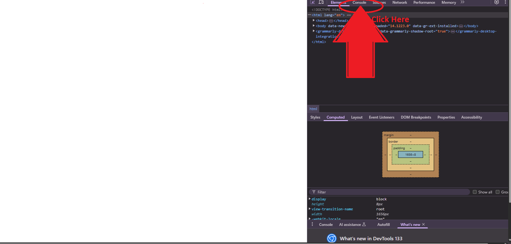
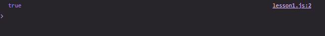
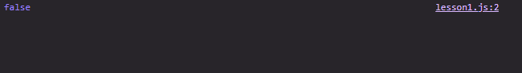
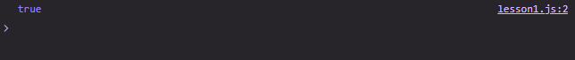

# Introduction to JavaScript

> Todo: Create a Javascript File to Work with

JavaScript, or JS for short, is a programming language used to add interactivity to web pages.

## The Basics of JavaScript

### Variables

A variable is simply a memory location that holds a value. Imagine your RAM as a cupboard: a variable is like a single compartment in that cupboard holding an item—say, a cup—and we can give that compartment a name, such as "myCup." Anytime we need the cup, we can refer to the cupboard and retrieve it from the compartment called "myCup."

#### Creating Variables

The format for creating variables in JavaScript is as follows:

```js
const variableName = "value";
```

or

```js
let variableName = "value";
```

**Understanding the syntax:**

1. **`let`/`const`:** These are keywords for creating variables in JavaScript.
   > **What is the difference between `let` and `const`?**  
   > If we use the `let` keyword, the variable's value can be changed later in our code. However, if we use `const`, we create a constant, meaning the value **cannot** be changed after the variable's creation.
2. **`variableName`:** This is the name of the variable we want to create. There are some rules to follow when naming variables:
   - Must start with a letter, underscore (`_`), or dollar sign (`$`).
   - Can include letters, numbers, underscores, and dollar signs.
   - Case sensitive (e.g., `myVar` ≠ `myvar`).
   - No spaces or special characters.
   - Cannot be a reserved keyword (e.g., `for`, `if`).
3. **`=`:** This is the assignment operator used to give a value to a variable.
4. **`"value"`:** This is the value we want to assign to the variable.
5. **`;`:** The semicolon is used to end statements in JavaScript and should always be placed at the end of our statements.

**For example:**

```js
const userName = "John Minang";
```

---

### Datatypes

A `datatype` is just a way of telling a computer what kind of information you are working with.

> Remember the cuboard example for variables, in this case imagine each compartment could only store a particular item e.g shoes, t-shirts, e.t.c. Now with data types you tell the computer what type of data you are working with so it knows how to store it, e.g if you want to store a t-shirt in your cupboard then it knows to store it only in a compartment that stores t-shirts.

#### Common Data Types in JS

1. **Number**:  
   The number data type is used to store numerical values, including whole numbers, numbers with decimal points, and negative numbers, etc.

   For example:

   ```js
   const age = 25;
   const weightInKg = 45.5;
   const caMark = -2;
   ```

2. **String**:  
   The string data type represents a set of characters, numbers, or symbols and must be enclosed in either double or single quotes (`""` or `''`).

   For example:

   ```js
   let userName = "johnMinang";
   const email = "johnMinang@npui.com";
   ```

3. **Boolean**:  
   The boolean data type is used to represent a true or false value. It can only have two possible values: `true` or `false`.

   For example:

   ```js
   let isOld = false;
   const isValid = true;
   ```

   > **Note:** Programmers often name boolean variables with a prefix such as `is` (e.g., `isValid`) because it makes the code easier to read and understand. The prefix turns the variable name into a question, with the boolean value providing the answer.

---

### Exercise 1

1. Create variables that hold your name, email, age, university level, and one that expresses whether or not you are from Cameroon.

---

### Input, Output and Template Strings

Before we can do anything with JavaScript that will be visible in our browser, we must first link our JS file to an HTML file. To do that:

- Create an HTML file.
- Create a script element at the end of the body within the HTML file:

  ```html
  <body>
    <script></script>
  </body>
  ```

- Use the `src` attribute in the script element, along with a relative path to your JS file, to link the JS file to the HTML file:

  ```html
  <script src="./lesson1.js"></script>
  ```

- Open your HTML file normally or with **Live Server** and we can continue.

> NB: Linking the HTML and JavaScript files is a necessary step for the browser to execute or run JavaScript.

#### Displaying Information to the Console

We can display data to our browser's console using the `console` object in JavaScript along with its `log` method.

> NB: We will discuss objects and methods in more detail later.

Here is the format for displaying data:

```js
console.log("My data");
```

To see the results:

- Open your HTML file in your browser.
- Inspect the page.
- Click on the Console tab:

  

- You should now see the output from your code.

  

> Throughout the course, when you are asked to access the console, this is the expected procedure.

##### Displaying Variables

If we need to display a variable, it will look something like this:

```js
const myName = "John Minang";
console.log(myName);
```

#### Template Strings

Template strings are a type of string that preserves the formatting as it is written in the code. They can also hold expressions or other variables. Instead of using double or single quotes, template strings are enclosed in backticks (\`\`), which is typically the key directly beneath your Esc key.

For example:

```js
const information = `
First name: John
Last name: Minang
Age: 32
`;

console.log(information);
```

#### Passing Variables inside Template Strings

The format for passing variables in template strings is as follows:

```js
`My data: ${variable}`;
```

For example:

```js
const firstName = "John";
const lastName = "Minang";
const age = 32;

const information = `
First name: ${firstName}
Last name: ${lastName}
Age: ${age}
`;

console.log(information);
```

#### User Input

To collect user input with JavaScript, we use the `prompt` function. This function asks the user to enter some data that we can store and use in our program. It follows the format below:

```js
const variableName = prompt("Question");
```

> NB: We shall discuss functions later in the course.

For example:

```js
const firstName = prompt("What is your first name?");
const lastName = prompt("What is your last name?");
const age = prompt("How old are you?");

const information = `
First name: ${firstName}
Last name: ${lastName}
Age: ${age}
`;

console.log(information);
```

#### A Strange Behavior of the Prompt Function

The `prompt` function always returns a string as the user input, even if we need a numerical value (e.g., an age). Therefore, if we need a numerical value from the user, we use the `Number` function to convert the input, as shown below:

```js
const variableName = Number(prompt("Question"));
```

For example:

```js
const age = Number(prompt("How old are you?"));
```

> NB: Converting a value from one data type to another is called **Type Casting**.

#### Example

Let us create a small program that asks users for their date of birth, uses it to calculate how old they are, and displays it in the console.

```js
const yearOfBirth = Number(prompt("What year were you born?"));
const solution = 2025 - yearOfBirth;

console.log(`You are ${solution} year(s) old.`);
```

---

### Arithmetic Operators

The arithmetic operators used in JavaScript are the same as those used in mathematics, although some symbols may have slightly different representations.

#### Common Arithmetic Operators

1. **+** : Addition
2. **-** : Subtraction
3. **\*** : Multiplication
4. **/** : Division
5. **%** : Modulus (returns the remainder after division)

For example:

```js
const addition = 2 + 2;
console.log(addition);

const subtraction = 2 - 2;
console.log(subtraction);

const division = 2 / 2;
console.log(division);

const multiplication = 2 * 2;
console.log(multiplication);

const modulus = 3 % 2;
console.log(modulus);
```

---

### Exercise 2

1. Write a JavaScript program that collects two numbers from the user and displays the sum of these numbers on the console.

---

### Conditionals

#### Comparison Operators

1. **=== (Equal to)**:
   This operator is used to check if two values are equal and of the same type. For example:

   ```js
   const compare = 2 === 2;
   console.log(compare);
   ```

   > You should see the result below in your console:
   > 

   Here, we notice that when the values being compared are equal, the comparison returns a boolean value of `true`. This is because the expression is `true` since `2` is equal to `2`.

2. **> (Greater than) and < (Less than)**:

   2.1 **>**: This operator is used to check if one value is greater than another. For example:

   ```js
   const compare = 2 > 2;
   console.log(compare);
   ```

   2.2 **<**: This operator is used to check if one value is smaller than another.

   ```js
   const compare = 2 < 2;
   console.log(compare);
   ```

   > You should get a value of `false`, as `2` is neither greater than nor less than itself.

   

3. **>= (Greater than or Equal to) and <= (Less than or Equal to)**:

   3.1 **>=**: This operator checks if one value is greater than or equal to another value.

   Example:

   ```js
   const compare = 2 >= 2;
   console.log(compare);
   ```

   3.2 **<=**: This operator checks if one value is less than or equal to another value.

   ```js
   const compare = 2 <= 2;
   console.log(compare);
   ```

   > The result should be `true` in the console, as `2` is both less than or equal to itself and greater than or equal to itself.

   

#### Logical Operators

What if we want to perform multiple comparisons and find their overall truth values? Logical operators help us achieve that.

1. **&& (AND)**:
   This operator returns `true` only if all the comparisons are true.

   Example:

   ```js
   const compare = 2 === 2 && 2 <= 2;
   console.log(compare);
   ```

2. **|| (OR)**:
   This operator returns `true` if **at least one** of the comparisons is true.

   Example:

   ```js
   const compare = 2 === 2 || 8 === 2;
   console.log(compare);
   ```

   > **Summary:** The `&&` operator returns `true` only if **all** conditions are true, whereas the `||` operator returns `true` if **at least one** condition is true.

#### If Statements

Now that we understand comparisons, comparison operators, and logical operators, how do we run some code only when a certain condition is true? We use `if statements` in various ways, as follows:

1. **If Statements**

   The structure is as follows:

   ```js
   if (condition) {
     // code
   }
   ```

   Basically, if the comparison or condition in the parentheses is `true`, the code inside the curly braces will execute. If the condition is `false`, the code will be ignored.

   > Example: Let’s build a program that tells a user if they are eligible to vote, given that the requirement is to be at least 18 years old.

   ```js
   const age = Number(prompt("Please enter your age:"));

   if (age >= 18) {
     console.log("You are eligible to vote.");
   }
   ```

2. **If/Else Statements**

   What if we want to tell users that they are not eligible to vote if they don’t meet the age requirement? In such cases, we use `if/else` statements, which follow this format:

   ```js
   if (condition) {
     // code
   } else {
     // code
   }
   ```

   Basically, if the condition is `true`, the code inside the `"if block"` will execute. If `false`, the code inside the `"else block"` will execute. Let's apply this to our voting example:

   ```js
   if (age >= 18) {
     console.log("You are eligible to vote.");
   } else {
     console.log("You are not old enough to vote.");
   }
   ```

   > **Note:** JavaScript checks conditions from top to bottom and stops as soon as it finds one that evaluates to `true`.

3. **Else If Statements**

   What if we wanted to tell users who are 17 years old that they can’t vote now but will be able to next year? We use an `if else` statement, which allows us to add extra conditions to our `if/else` tree. The format is as follows:

   ```js
   if (condition) {
     // code
   } else if (condition) {
     // code
   } else {
     // code
   }
   ```

   Basically, if the first condition is `false`, the `else if` condition will be checked. If it is `true`, all other code in the tree will be ignored, and only the code inside that `else if` block will be executed.

> **Note:** We can have as many `else if` branches as needed, but conditions will be checked in order, and only the first `true` condition will execute its block of code, ignoring the rest. If none of the conditions are `true`, the `else` block will execute.

Let's modify our voting program to use `else if`:

```js
if (age >= 18) {
  console.log("You are eligible to vote.");
} else if (age === 17) {
  console.log(
    "You are not old enough to vote, but you will be able to next year."
  );
} else {
  console.log("You are not old enough to vote.");
}
```

---

### Exercise 3

1. Create a JavaScript program with two predefined string variables:

- `password` with a value of `"000000"`
- `username` with a value of `"johnMinang"`

Your program should prompt the user to enter their username and password.

- If the user enters the correct username **and** password (matching the predefined values), display `"You are logged in"` in the console.
- If either the username or password is incorrect, display an error message in the console.

---

Here’s the corrected version with proper grammar, spelling, and improved clarity:

---

### **Loops in JavaScript**

A loop is a programming feature that allows the computer to repeat the same task multiple times automatically. Think of a loop like runners jogging around a football field during warm-ups—they keep going around the field repeatedly, doing the same thing over and over.

#### **Common Loops in JavaScript**

##### **1. For Loops**

A `for` loop allows us to execute some code a specific number of times, which we determine beforehand. Here is an example of a `for` loop:

```js
for (let i = 0; i < 5; i++) {
  console.log("Hello, World!");
}
```

> **Explanation:**

1. **`let i = 0;`** → Initializes a variable named `i` and sets it to `0`.
2. **`i < 5;`** → A **comparison condition** that checks if `i` is less than `5`. If `true`, the loop continues.
3. **`i++`** → **Increments `i` by 1** (increases `i` by `1` after each loop iteration).
   > **Note:** The opposite could be achieved with `i--`, which decrements `i` by `1`.
4. **How the loop works step-by-step:**
   - **Step 1:** The initial value of `i` is `0`.
   - **Step 2:** The condition `i < 5` is checked. If `true`, the code inside the `{}` executes.
   - **Step 3:** `i++` increases `i` by `1`.
   - **Step 4:** Steps 2-3 repeat until the condition `i < 5` becomes `false`.
   - **Step 5:** Once `i` reaches `5`, the loop stops, and the program moves to the next task.

##### **2. While Loops**

A `while` loop allows us to repeatedly execute a block of code as long as a specified condition remains `true`. For example:

```js
let i = 5;

while (i > 0) {
  console.log("i is greater than 0.");
  i--;
}
```

> **Explanation:**

1. **`let i = 5;`** → Declares a variable `i` and initializes it with `5`.
2. **`i > 0;`** → A **comparison condition** that checks if `i` is greater than `0`. If `true`, the loop continues.
3. **`i--`** → Decreases `i` by `1` after each iteration (**equivalent to `i = i - 1`.**).
4. **How the loop works step-by-step:**
   - The program checks if `i > 0`.
   - If `true`, it **executes the code inside the `{}`.**
   - After each execution, `i--` decreases `i` by `1`.
   - Once `i` reaches `0`, `i > 0` becomes **false**, and the loop stops.

> > **When to Use Each Loop?**

- Use a `for` loop when you **know in advance** how many times the loop should run.
- Use a `while` loop when the number of repetitions **depends on a condition** rather than a fixed count.

---

### **Exercise 4**

Write a program that collects the user's date of birth, calculates their age, and then displays **"Happy Birthday!"** as many times as their age.

---

### Commenting in JavaScript

A comment is a part of the code that the computer ignores during execution.

#### How to Add Comments in JavaScript

##### 1. Single-Line Comments (`//`)

These are comments that are just a single line long and follow this format:

```js
// This is a single-line comment
```

##### 2. Multi-Line Comments (`/* */`)

These are comments that span multiple lines in the program:

```js
/*
 This is a
 multi-line comment
*/
```

> Why Use Comments?

- To document code
- To better explain certain parts of your code
- To temporarily disable some parts of your code without deleting them

> **Note**

In **VS Code**, you can use a shortcut to create comments:

1. Select the area or lines you want to comment.
2. Press `Ctrl + /` (Windows/Linux) or `Cmd + /` (Mac).
