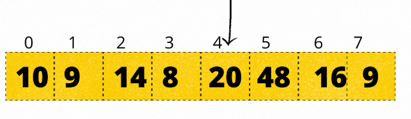
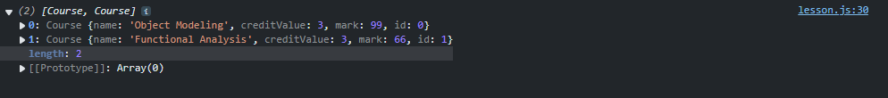

# Lesson 2: Using JavaScript in Our UIs

From this point in the course, we will build a small project to help us better understand the concepts taught in the lessons and to gain some hands-on experience using JavaScript to build our UIs.

> Task: Ensure you have the resources for this lesson and have successfully placed them in your work folder.

---

## Setting Up Our Project

1. **Project Folder:**  
   Ensure you have the GPA Calculator project in your folder.

2. **Modify the HTML File:**  
   Open the `index.html` file and add the following code at the end of the `<body>` tag:

   ```html
   <script type="module" src="./scripts/main.js"></script>
   ```

   _This `type="module"` attribute tells the browser to treat the script as a module, allowing you to use `import` and `export` statements in your JavaScript code. We will discuss this in more detail later._

3. **Ready to Move On:**  
   If you have completed the above steps, we can continue with the lesson.

---

## Introduction to Data Structures in JavaScript

A data structure is simply a way of storing data in a computer. Let's look at some data structures we will come across in most JavaScript projects.

### Objects

In many object-oriented languages, objects are instances of classes. In JavaScript, while objects can be created as instances of classes (using the `class` syntax), they are more commonly used as plain collections of key-value pairs that follow the format:

```js
{
  key1: "value1",
  key2: "value2",
}
```

> **Note:** We will discuss classes later in the course.
> **Explanation:**
>
> 1. **Creating an Object:**  
>    You create an object much like you create a variable. For example:
>
>    ```js
>    const myObj = {
>      key1: "value1",
>      key2: 0,
>    };
>    ```
>
> 2. **Structure:**  
>    An object is defined using curly braces `{}` containing as many key-value pairs as needed.
>
> 3. **Naming Keys:**  
>    The keys should follow the same naming rules as variables.
>
> 4. **Values:**  
>    Values can be strings, numbers, booleans, other objects, or functions (which we will discuss later).

#### Accessing Values in Objects

To access a value in an object, use the dot operator. For example, to log the value of `key1` from `myObj`:

```js
console.log(myObj.key1);
```

### Exercise 5

1. Create an object that contains your name, email, age, university level, and a boolean indicating whether you are from Cameroon. Then, print all this information in the console.

---

## Arrays

An array is a linear set of data elements. Think of it like a cupboard with compartments: while a variable can hold just a single item, an array is like a compartment that has its own sub-compartments where you can store multiple items. Arrays are defined using square brackets containing comma-separated values. You can store an array in a variable like so:

```js
["val1", "val2"];
```

For example:

```js
[10, 9, 14, 8, 20, 48, 16, 9];
```

> **Explanation:**
>
> - To create an array, assign an array literal (a list of values inside square brackets) to a variable. For example:
>
>   ```js
>   const numbers = [10, 9, 14, 8, 20, 48, 16, 9];
>   ```
>
> - All the data elements in your array must be inside the square brackets `[]`.
> - Each element in an array must be separated by a comma (`,`).
> - The data elements in an array can be strings, numbers, booleans, or even objects.
> - While arrays can contain a mixture of data types, a good practice is to create arrays with data elements of the same type.

### Accessing Values in Arrays

Every element in an array is stored in a specific position. These positions are labeled with numerical values starting from `0`. For example, in our numbers array, the elements are positioned as shown below:



As shown in the image above, the value `20` will be at position `4`.

To access these values, we use the following format:

```js
arrayName[position];
```

For example, if we want to log the value `20` from our array:

```js
console.log(numbers[4]);
```

> **Note:**  
> Remember, array indices in JavaScript start at 0, so the first element is at position 0, the second at position 1, and so on.

Below is the corrected Markdown file:

#### Adding Elements to an Array

We use the `push` method to add an element at the end of an array. Here's how:

```js
arrayName.push(element);
```

For example, let's add an element to our `numbers` array and log it to the console to see the changes:

```js
numbers.push(88);
console.log(numbers);
```

---

## Classes

A class is a blueprint for an object. For now, think of it as code that defines the key-value pairs an object will have.

### Creating a Class

1. **Use the `class` Keyword:**  
   Define a class with the `class` keyword followed by the class name.

2. **Constructor Method:**  
   Use a special method called `constructor` to initialize the object’s properties.

**Example:**

```js
class Student {
  constructor(name, age) {
    // 'this' refers to the object being created
    this.name = name;
    this.age = age;
  }
}
```

#### Explanation of the Code

Imagine you’re making a blueprint for a student. This blueprint tells us what details every student should have (like a name and an age).

1. **Creating a Blueprint (Class):**  
   We use the word `class` to start our blueprint. We name it `Student` (notice the capital letter—this is a common practice to show it’s a blueprint).

2. **The Special Recipe (Constructor):**  
   Inside our blueprint, we have a special function called the **constructor**. Think of it as a recipe that tells us what information every student must have when we create one.

3. **Setting Up the Details (Properties):**  
   The constructor takes in two pieces of information: `name` and `age`.
   - **`this.name = name;`**  
     This line tells the computer: "Take the name we give when creating a student and save it as that student's name."
   - **`this.age = age;`**  
     Similarly, this saves the age we provide as the student’s age.

#### Creating an Object (Instance)

- **Use the `new` Keyword:**  
  To create a new object from a class, use the `new` keyword with the class name and provide the necessary values for the object's key-value pairs.

**Example using our Student class:**

```js
const student = new Student("John", 32);
```

> **Note:**  
> You can create as many objects as you need from the same class, each with its own unique values.

---

## Project Work

Let us create a class to represent courses in our **GPA Calculator** app. We will be working in our `main.js` file, located in the scripts folder, for now.

Let us create our **Course** class, and an empty array to store our course in when created:

```js
const courses = [];

class Course {
  constructor(name, creditValue, mark) {
    this.name = name;
    this.creditValue = creditValue;
    this.mark = mark;
  }
}
```

Now, let's create an object from the Course class, log it, and see how it works:

```js
const myCourse = new Course("Object Modeling", 3, 99);

console.log(myCourse);
```

---

## Exercise 6

1. Write a program that allows a user to store books in a library.

**Instructions:**

- Create a class that represents a Book. Each book should have:
  - A title
  - An author
  - A release year
- Allow the user to create as many books as they want.
- After the user enters the details for a book, ask if they want to end the process or continue. If they choose to end the process, stop asking for more books; otherwise, allow them to create another book.
- Store all the books in an array.
- At the end of the process, log the array to the console so that the user can see all the books created.

## Functions and Methods

A function is a block of code that can be reused anywhere in our program without having to rewrite it every time. Below is the syntax for defining a function:

```js
function functionName() {
  // code
}
```

We can add code within the curly braces. For example:

```js
function greetings() {
  console.log("Hi there!");
}
```

How do we use the code in our function? We call the function like this:

```js
greetings();
```

### Arrow functions

Arrow functions are almost the same as regular functions, except for two differences:

1. Arrow functions are assigned to variables.
2. Arrow functions have a different syntax.

```js
const greetings = () => {
  console.log("Hi there");
};
```

Writing the function like this works the same way as a regular function.

> What is the difference between regular functions and arrow functions?  
> Regular functions are hoisted, meaning they can be called before they are defined in the code, whereas arrow functions must be defined before they are used.

### Input

Functions can also accept inputs called parameters. These parameters are values passed to the function when it is called and are used like variables within the function. The parameters are written inside the parentheses of the function definition.

For example:

```js
function greetings(name) {
  console.log(`Hi there ${name}!`);
}

greetings("John");
```

### Output

Functions can also return a value. This value can be of any type: integers, booleans, strings, objects, or even other functions. The returned value can be stored in a variable or used directly. To return a value from a function, we use the `return` keyword, like this:

```js
const greetings = (name) => {
  return `Hi there ${name}`;
};

const userGreetings = greetings("John");
console.log(userGreetings);
```

> NB: Once the `return` keyword is executed in a function, the function immediately stops executing. This means any code written after the `return` statement will **not** be executed.

### Methods

When we learned about classes, we saw the constructor, for example:

```js
class Course {
  constructor(name, creditValue, mark) {
    this.name = name;
    this.creditValue = creditValue;
    this.mark = mark;
  }
}
```

Notice that the constructor is a function that follows the same rules as regular functions. In the context of a class, any function is called a **method**. The constructor is a special method that is automatically called when a new object is created from the class. Additionally, you can define other methods that are called later when needed. For example:

```js
class Course {
  constructor(name, creditValue, mark) {
    this.name = name;
    this.creditValue = creditValue;
    this.mark = mark;
  }

  displayInformation() {
    console.log(`
        Course Name: ${this.name}
        Credit Value: ${this.creditValue}
        Mark: ${this.mark}
        `);
  }
}
```

Note that methods in classes cannot be written as arrow functions; they must be defined using the regular function syntax without the `function` keyword. Also, remember that we access values in an object using the dot operator. The `this` keyword refers to the object being created, so `this.property` is used to access the value of that property.

#### Accessing a method from an object

To access a method from an object, we use the dot operator and call the function just as discussed above. For example:

```js
const mycourse = new Course("Object Modeling", 3, 99);
mycourse.displayInformation();
```

> NB: Almost everything in JavaScript is an object that has its own properties and methods, and we will use this concept frequently from now on.

## Project Work 2

Let us go back to our main.js file. At this point in the project, we want each course to have a unique ID, and we need to create a system for this as follows:

```js
class Course {
  constructor(name, creditValue, mark) {
    this.name = name;
    this.creditValue = creditValue;
    this.mark = mark;

    // We perform this action in the constructor because it is called when a new object is created.

    // The .length property of an array gives us the number of elements in that array.
    if (courses.length === 0) {
      // If no element is in the array, this means the object we are creating is the first course, so we give it an id of 0.
      this.id = 0;
    } else {
      // We access the last element in the array by using (array length - 1), which always gives us the position of the last element.
      // Then, we access the id property of that element and increase it by 1 to create the id for the new course.
      this.id = courses[courses.length - 1].id + 1;
    }

    // Finally, we add the object being created to the array holding our courses.
    courses.push(this);
  }
}
```

Let us create two course objects and log our courses array to the console to see the changes we've made.

```js
const myCourse = new Course("Object Modeling", 3, 99);
const myCourse2 = new Course("Functional Analysis", 3, 66);

console.log(courses);
```

You should see a result like this:



---

## Exercise 7

Write a program that does the following:

1. Ask the user for two values.
2. Ask the user for a mathematical operation (addition, subtraction, division, or multiplication).
3. Create a function that takes these two input values as parameters.
4. The function should return:
   - The sum of the numbers for addition.
   - The product of the numbers for multiplication.
   - The result of the first number divided by the second for division.
   - The difference of the first number minus the second for subtraction.

At the end, print the result of the operation to the console.

---

## Break

You must be thinking this lesson is about using JavaScript in our UIs, so why have we only been working in the console? Well, there were certain concepts we needed to advance our project. Let us now actually look at how to incorporate JavaScript in our HTML and CSS UIs.

---

## The DOM

DOM stands for **Document Object Model**. Think of the DOM as a blueprint for a house, or in this case, the blueprint for a webpage. Now, think of the walls, chairs, tables, roof, etc., as the HTML structure of the page. The DOM not only shows us where everything is located, but also allows us to modify these elements on the webpage—for example, adding a door to the house while the occupants are still inside it. In the case of the web, the DOM can allow us to dynamically display text when a user clicks a button.

Let us now look at some concepts in DOM manipulation.

### Selecting HTML elements in JavaScript

There are two main ways of selecting an HTML element in JavaScript, all using the Document Object Model (DOM):

1. **Pre-requisite**  
   Let us first create an HTML element and give it a class and an ID, so we can work with this element in our JavaScript. For example:

   ```html
   <button class="js-btn" id="my-btn">Click Me!</button>
   ```

   > Notice that the class of the button starts with `js`. It is common practice to prefix class names intended for JavaScript manipulation with `js-`.

2. **Selecting an Element By Id**  
   To select an element by its ID, we follow the syntax:

   ```js
   document.getElementById("my-btn");
   ```

   > Note: When using `getElementById`, pass the ID as a string without the `#` prefix.

3. **Using A Query Selector**  
   We can select an HTML element using a CSS selector, e.g., `#my-btn` for an ID or `.js-btn` for a class. For example:

   ```js
   document.querySelector(".js-btn");
   ```

   > NB: As we continue, we will be using the query selector method most of the time.

Now, once you select an element, you can store it in a variable and log it to your console to inspect the selected element. For example:

```js
const btnElement = document.querySelector(".js-btn");

console.log(btnElement);
```

Once you select an element, you can manipulate it as desired. For example, you can change the background color of the button using JavaScript as follows:

```js
const btnElement = document.querySelector(".js-btn");

btnElement.style.backgroundColor = "red";
```

> > Note: By now you should be noticing that the elements we select are objects themselves with their own propeties and methods.

---

### Event Listeners

An **event listener** is a special type of function in JavaScript that waits for something to happen to an element (called an **event**). Once that event occurs, the function executes another function called a **callback function**.

Let's see an example using a button:

```js
const btnElement = document.querySelector(".js-btn");

btnElement.addEventListener("click", () => {
  console.log("You just clicked the button.");
});
```

> **Explanation:**
>
> - Every element in JavaScript has access to the `addEventListener` method.
> - The `addEventListener` method takes two arguments:
>   1. The **event** to listen for (e.g., `"click"`).
>   2. A **callback function** (in this case, an arrow function) that executes when the event occurs.

---

#### Common Events We Can Listen For

JavaScript provides a wide range of events you can listen for. While learning them all at once can be overwhelming, you'll naturally encounter and use different events as you work on projects.

Below are some common events, categorized based on their use cases:

##### 🔹 **Mouse Events**

- `"click"` – Triggered when an element is clicked.
- `"dblclick"` – Triggered when an element is double-clicked.
- `"mousedown"` – Triggered when a mouse button is pressed.
- `"mouseup"` – Triggered when a pressed mouse button is released.
- `"mousemove"` – Triggered when the mouse moves over an element.
- `"mouseover"` – Triggered when the mouse enters an element.
- `"mouseout"` – Triggered when the mouse leaves an element.
- `"contextmenu"` – Triggered when the right-click menu is opened.

##### ⌨️ **Keyboard Events**

- `"keydown"` – Triggered when a key is pressed down.
- `"keyup"` – Triggered when a key is released.
- `"keypress"` – _(Deprecated, use `"keydown"` instead.)_

##### 🖼️ **Form Events**

- `"submit"` – Triggered when a form is submitted.
- `"change"` – Triggered when an input value changes (e.g., dropdowns, checkboxes).
- `"input"` – Triggered when a user types in an input field.
- `"focus"` – Triggered when an input field is focused.
- `"blur"` – Triggered when an input field loses focus.

##### 📜 **Window & Document Events**

- `"load"` – Triggered when the page finishes loading.
- `"DOMContentLoaded"` – Triggered when the HTML is fully loaded before images and styles.
- `"resize"` – Triggered when the window is resized.
- `"scroll"` – Triggered when the user scrolls.

##### 📡 **Touch Events (for Mobile Devices)**

- `"touchstart"` – Triggered when a touch starts.
- `"touchmove"` – Triggered when a touch moves.
- `"touchend"` – Triggered when a touch ends.

##### 🎤 **Media Events**

- `"play"` – Triggered when a video or audio starts playing.
- `"pause"` – Triggered when playback is paused.
- `"ended"` – Triggered when media playback reaches the end.

##### ⚡ **Drag & Drop Events**

- `"dragstart"` – Triggered when dragging starts.
- `"dragover"` – Triggered when an element is dragged over another.
- `"drop"` – Triggered when an element is dropped.

---

### Modifying an Element's Contents

Once we select an element from an HTML document, we can change its content. Since the elements we select are objects, we can use a property called `innerHTML` to modify the element’s contents. This property allows us to replace the current HTML with a new string that will be rendered by the browser.

Let us continue working with our button.

```js
const btnElement = document.querySelector(".js-btn");

btnElement.addEventListener("click", () => {
  // Wait for the user to click the button, then change its text.
  btnElement.innerHTML = "You successfully clicked me.";
});
```

We can further toggle the behavior of the button by switching between the original and new text each time the user clicks it. For example:

```js
const btnElement = document.querySelector(".js-btn");

btnElement.addEventListener("click", () => {
  // Use an if statement to check if the button contains the default text.
  // If it does, replace it with the new text; otherwise, revert to the default text.
  if (btnElement.innerHTML === "Click Me!") {
    btnElement.innerHTML = "You successfully clicked me.";
  } else {
    btnElement.innerHTML = "Click Me!";
  }
});
```

Above, we have successfully used concepts of DOM manipulation and conditional statements to create a toggling behavior.

### Exercise 8

1. Create an app with a button that, when clicked, asks for the user's name and displays a greeting message on the web page with the user's name.

Below is the corrected version in Markdown. I’ve fixed typos, improved grammar, and ensured the explanations remain factual and easy to understand. Note that the number of hashtags in the headings remains unchanged.

---

### Rendering HTML with JavaScript

We can also use the **innerHTML** property to render HTML on the web page. For example, if we want an app that, when the user clicks on a login button, displays a form for the user to input their name and password.

Let us start with the HTML:

```html
<!-- Create a button with a class, and link your JavaScript file -->
<button class="js-login-btn">Login</button>

<!-- Creating an empty form -->
<form action="" class="js-login-form"></form>

<script src="./lesson.js"></script>
```

Let us now work on the JavaScript side of things.

```js
// Selecting our button and form from the HTML
const loginButton = document.querySelector(".js-login-btn");
const loginForm = document.querySelector(".js-login-form");

// Preparing the HTML we need to render
const formHTML = `
    <input type="text" name="" id="" placeholder="User name" />
    <input type="password" name="" id="" placeholder="Password" />
`;

// Listening for when the user clicks the login button
document.querySelector(".js-login-btn").addEventListener("click", () => {
  // Inserting the HTML into the form when the user clicks
  loginForm.innerHTML = formHTML;
});
```

> > Notice the HTML is simply just regular HTML, but in a string

### Class List

The class list of an element is, as the name suggests, a list of all the classes assigned to that element. We can use JavaScript to add classes to an element’s class list and also remove classes from it. Naturally, adding or removing a class will reflect the styles of that element on the web. To manipulate the class list of an element, we use the `classList` property that all elements have. This property is an object with methods, and these methods allow us to manipulate the class list of selected elements.

Let us set up a small project to work with.

Let's have some HTML:

```html
<button class="js-sub sub-btn">Subscribe</button>
<script src="./lesson.js"></script>
```

Let's now have some CSS for our code:

```css
body {
  display: flex;
  align-items: center;
  justify-content: center;
  height: 100vh;
  background-color: rgb(15, 16, 20);
}

.sub-btn {
  cursor: pointer;
  width: 80rem;
  height: 10rem;
  font-size: 5rem;
  border: none;
  transition: opacity 0.2s ease-in-out;
  border-radius: 5rem;
  background-color: white;
}

.sub-btn:hover {
  opacity: 0.9;
}

.btn-on {
  color: white;
  background-color: rgba(255, 255, 255, 0.1);
}
```

Let's get to work.

#### Adding a Class to the Class List

To add a class to an element, we use the `add` method of the `classList` property and pass the class we wish to add to that element’s class list. Let us add a class to the button from our HTML using JavaScript.

```js
// Selecting the element first
const subBtn = document.querySelector(".js-sub");

// Creating a click event for the button so that when the user clicks, we change the class
subBtn.addEventListener("click", () => {
  // Change the text in the button
  subBtn.innerHTML = "Subscribed";

  // Using the add method to add a class to the class list of that element.
  subBtn.classList.add("btn-on");
});
```

#### Removing a Class from the Class List

To remove a class from an element, we use the `remove` method of the `classList` property and pass the class we wish to remove from that element’s class list. Let us remove a class from the subscribe button from our HTML using JavaScript.

```js
subBtn.addEventListener("click", () => {
  // Creating the if statement to toggle the text and the class of the button
  if (subBtn.innerHTML === "Subscribe") {
    subBtn.innerHTML = "Subscribed";
    subBtn.classList.add("btn-on");
  } else {
    subBtn.innerHTML = "Subscribe";

    // Using the remove method to remove the `btn-on` class from the element.
    subBtn.classList.remove("btn-on");
  }
});
```

### Project Work 3

Now let us write some JavaScript to display the create course form when the user clicks on the create course button in our project UI.

Let us continue working in our `main.js` file.

1. Select the button, overlay div, and close button with classes already placed in the HTML:

   ```js
   const addCourseBtn = document.querySelector(".js-add-course-btn");
   const popUpOverlay = document.querySelector(".js-pop-up-overlay");
   const closeOverlayBtn = document.querySelector(".js-close-overlay-btn");
   ```

2. Add an event listener so that when the user clicks on the add course button, we remove the class that hides the overlay:

   ```js
   addCourseBtn.addEventListener("click", () => {
     popUpOverlay.classList.remove("hide-overlay");
   });
   ```

3. Add an event listener to the close button so that when the user clicks on it, it adds back the class that hides the overlay:

   ```js
   closeOverlayBtn.addEventListener("click", (e) => {
     e.preventDefault(); // This line will be discussed later when we treat forms in JavaScript
     popUpOverlay.classList.add("hide-overlay");
   });
   ```

You can now test the behavior of the add course button.
