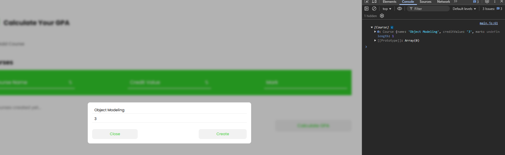

# Project work 4

## Forms

By default, when you click the submit button in a form, the form gets submitted to a server. If there is no server, the page refreshes. This is the default behavior when clicking a form’s submit button. However, since we are not submitting our form to any server, we need to catch this event and stop the default behavior using the `preventDefault()` method. To do this, we must first pass the event as a parameter to our event listener’s callback function. Let us now do this.

1. Select the create course button from the create course form in the HTML.

   ```js
   const createCourseBtn = document.querySelector(".js-create-course-btn");
   ```

2. Use the `preventDefault()` method to stop the form from submitting when the create course button is clicked.

   ```js
   createCourseBtn.addEventListener("click", (e) => {
     // Using the preventDefault() method on the click event
     e.preventDefault();
   });
   ```

> Now we want to collect the inputs the user places in our form, use them to create a course object, and store that course in our course array. To do this we must first find a way to collect the inputs entered by the user. The process is:
>
> 1. Select the element.
> 2. Use the `.value` property to get the input entered by the user.

Let us now apply this to our project:

1. Select the input elements in the create course form using their classes:

   ```js
   const createCourseBtn = document.querySelector(".js-create-course-btn");
   const courseNameInput = document.querySelector(".js-create-course-input");
   const courseCreditValueInput = document.querySelector(
     ".js-course-credit-value-input"
   );

   createCourseBtn.addEventListener("click", (e) => {
     // Using the preventDefault() method on the click event
     e.preventDefault();
   });
   ```

2. Use the `.value` property on the selected input elements to get the values entered by the user:

   ```js
   createCourseBtn.addEventListener("click", (e) => {
     // Using the preventDefault() method on the click event
     e.preventDefault();

     // Collecting user inputs with the .value property
     const courseName = courseNameInput.value;
     const courseCreditValue = Number(courseCreditValueInput.value);
   });
   ```

3. Create a new course object with the values obtained from the user, and print out the courses array to see if the course was successfully created.

   ```js
   const newCourse = new Course(courseName, courseCreditValue);
   console.log(courses);
   ```

4. Try creating a course by clicking on the create course button in your UI, and verify in the console that the new course has been added. You should see a result similar to what is shown in the image below.

   

5. If you have any issues, ensure that the final event listener callback function for the create course button click event looks like this:

   ```js
   createCourseBtn.addEventListener("click", (e) => {
     // Using the preventDefault() method on the click event
     e.preventDefault();

     // Collecting user inputs with the .value property
     const courseName = courseNameInput.value;
     const courseCreditValue = Number(courseCreditValueInput.value);

     const newCourse = new Course(courseName, courseCreditValue);

     console.log(courses);
   });
   ```

### Form validation

Form validation ensures that the user provides the correct input in the form. The first thing we can do is ensure that for string inputs there are no extra spaces before or after the value; for that, we use the `.trim()` method. For example:

```js
const courseName = courseNameInput.value.trim();
```

We can go further by checking if the user input is correct and, if not, displaying an error message to guide the user. To do this, we shall create a function to handle validation. Create this function before the `createCourseBtn` event listener.

1. Create an array to store our errors and a function that takes two input values: the course name and the course credit value.

   ```js
   let createCourseErrors = [];

   const createCourseFormValidation = (courseName, courseCreditValue) => {};
   ```

2. Inside the function, use if statements to check the user input:

   ```js
   // Using if statements to catch errors
   // !courseName will return true if no value is assigned to courseName
   if (!courseName) {
     // Pushing a string into the array that explains the error to the user
     createCourseErrors.push("Course Name is required");
   } else if (!courseCreditValue) {
     createCourseErrors.push("Course credit value is required");
   } else if (courseCreditValue < 1) {
     createCourseErrors.push("Course credit value must be greater than 0");
   }
   ```

3. If there are any errors in our array, use the `alert()` function to display an error message to the user, reset the errors array, and return `true` (to indicate that validation failed).

   ```js
   if (createCourseErrors.length > 0) {
     // Sending a message to the user with the error
     alert(createCourseErrors[0]);

     // Resetting the create course errors array
     createCourseErrors = [];
     return true;
   }
   ```

   > > Note: `alert()` is a JavaScript function that displays a message to the user in a pop-up.

4. At the end of the function, return `false` by default (indicating no validation errors).

   ```js
   return false;
   ```

5. The final function should look like this:

   ```js
   const createCourseFormValidation = (courseName, courseCreditValue) => {
     // Using if statements to catch errors
     // !courseName will return true if no value is assigned to courseName
     if (!courseName) {
       // Pushing a string into the array that explains the error to the user
       createCourseErrors.push("Course Name is required");
     } else if (!courseCreditValue) {
       createCourseErrors.push("Course credit value is required");
     } else if (courseCreditValue < 1) {
       createCourseErrors.push("Course credit value must be greater than 0");
     }

     if (createCourseErrors.length > 0) {
       // Sending a message to the user with the error
       alert(createCourseErrors[0]);

       // Resetting the create course errors array
       createCourseErrors = [];
       return true;
     }

     return false;
   };
   ```

6. Finally, use the create course validation function in the add course button event listener:

   ```js
   createCourseBtn.addEventListener("click", (e) => {
     // Using the preventDefault() method on the click event
     e.preventDefault();

     // Collecting user inputs with the .value property
     const courseName = courseNameInput.value.trim();
     const courseCreditValue = Number(courseCreditValueInput.value);

     // Checking validation
     if (createCourseFormValidation(courseName, courseCreditValue)) {
       return;
     }

     const newCourse = new Course(courseName, courseCreditValue);

     console.log(courses);

     // Clearing the input boxes after creating the course
     courseNameInput.value = "";
     courseCreditValueInput.value = "";
   });
   ```

If the create course validation function returns `true`, we use the `return` keyword to stop the execution of the function.

Before moving forward, add one more validation step to ensure that the user does not add a duplicate course to the course array:

```js
else if (courses.find((course) => course.name === courseName)) {
  createCourseErrors.push("The course you are trying to create already exists.");
}
```

The expression `courses.find((course) => course.name === courseName)` checks if a course with the same name as the new course already exists. If it does, it returns a truthy value; otherwise, it returns `undefined`.

So, the final create course validation function is:

```js
const createCourseFormValidation = (courseName, courseCreditValue) => {
  // Using if statements to catch errors
  // !courseName will return true if no value is assigned to courseName
  if (!courseName) {
    // Pushing a string into the array that explains the error to the user
    createCourseErrors.push("Course Name is required");
  } else if (!courseCreditValue) {
    createCourseErrors.push("Course credit value is required");
  } else if (courseCreditValue < 1) {
    createCourseErrors.push("Course credit value must be greater than 0");
  } else if (courses.find((course) => course.name === courseName)) {
    createCourseErrors.push(
      "The course you are trying to create already exists."
    );
  }
  if (createCourseErrors.length > 0) {
    // Sending a message to the user with the error
    alert(createCourseErrors[0]);

    // Resetting the create course errors array
    createCourseErrors = [];
    return true;
  }

  return false;
};
```

Before we can say we are done with the create course form, at the end of the callback function for the `createCourseBtn` event listener, clear the input boxes by setting the value of the input elements to an empty string:

```js
courseNameInput.value = "";
courseCreditValueInput.value = "";
```

## Exercise 9

1. Create a web page with two predefined string variables:
   - `password` with a value of `"000000"`
   - `username` with a value of `"johnMinang"`

Your program should provide the user with a form to enter their username and password.

- If the user enters the correct username **and** password (matching the predefined values), display `"You are logged in"` using an alert message.
- If either the username or password is incorrect, display an error message using an alert.

---
